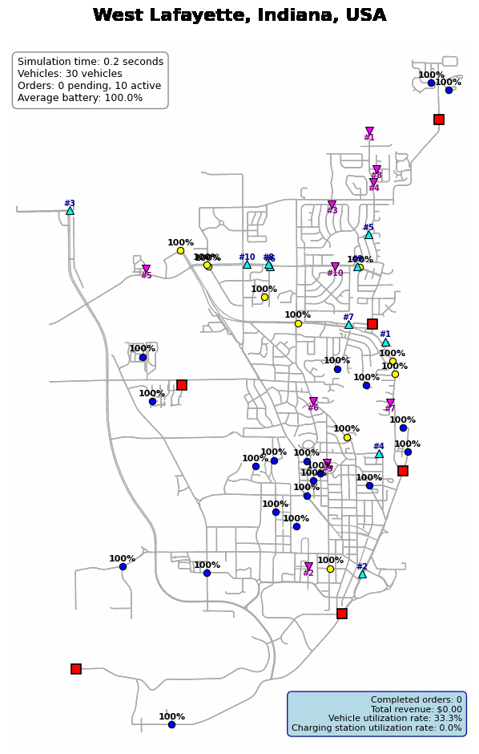
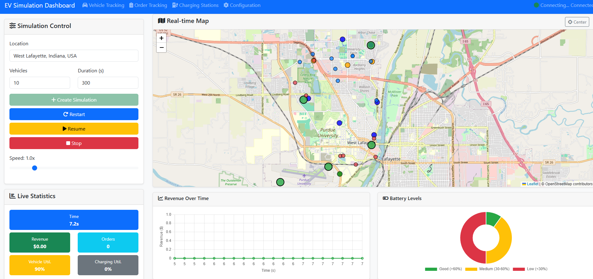
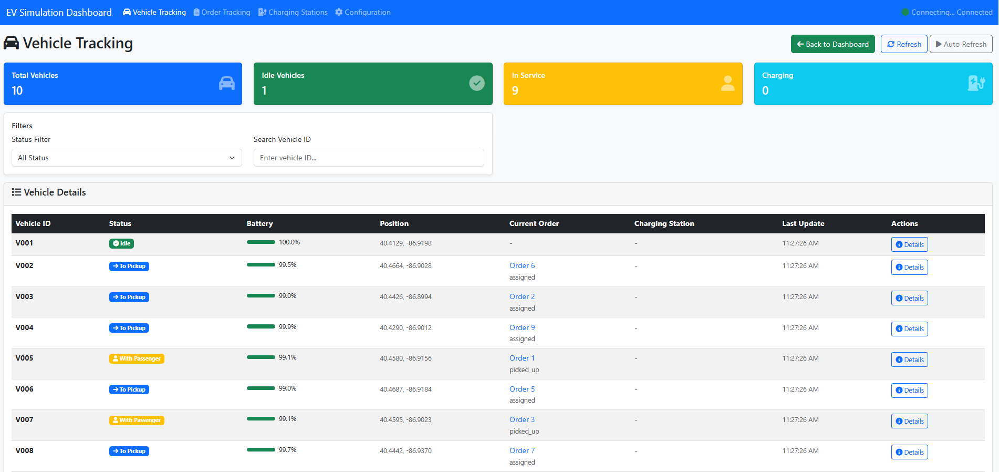
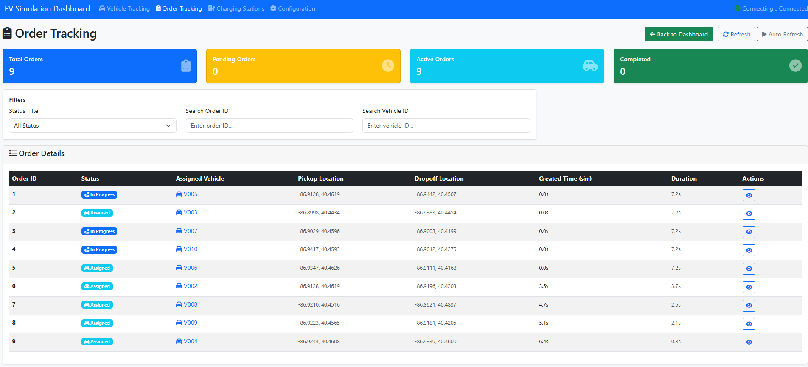
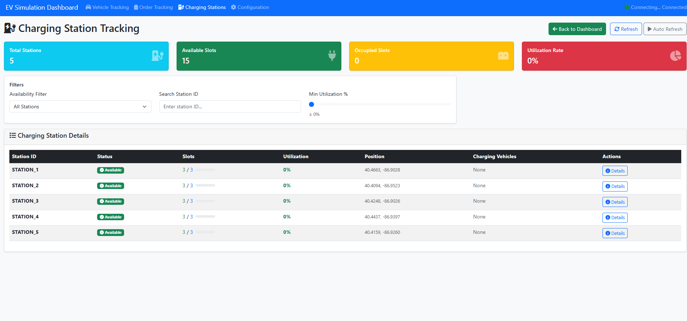

# Electric Vehicle Fleet Simulation System

<div align="center">

A comprehensive electric vehicle fleet simulation system featuring dual simulation engines, real-world map integration, and modern web interface for urban mobility analysis.

## 🎬 Live Demo

### Python Simulation Engine
<div align="center">
  
  <p><em>Real-time vehicle simulation with matplotlib visualization</em></p>
</div>

### Web Application Interface

<div align="center">
  
  <p><em>Main dashboard: simulation control and real-time map</em></p>
  
  <p><em>Vehicle tracking: status and battery monitoring</em></p>
  
  <p><em>Order tracking: assignment and progress</em></p>
  
  <p><em>Charging station management: availability and utilization</em></p>
</div>

[](https://www.python.org/downloads/)
[](https://fastapi.tiangolo.com/)
[](https://osmnx.readthedocs.io/)
[](LICENSE)

</div>

---

## Overview

This is a state-of-the-art electric vehicle fleet simulation system designed for comprehensive urban mobility analysis. The system provides **dual simulation architectures** to meet different research and demonstration needs:

1. **🐍 Python Simulation Engine**: YAML-configured standalone simulation with matplotlib visualization
2. **🌐 Web Application System**: Modern browser-based interface with real-time interaction

Both systems share the same sophisticated simulation core while offering different user experiences and deployment scenarios.

## Key Features

### 🏗️ **Dual Simulation Architecture**
- **Standalone Python Engine**: Command-line driven with YAML configuration
- **Web Application Interface**: Browser-based with real-time controls
- **Shared Core Logic**: Both systems use identical simulation algorithms

### 🗺️ **Real-World Map Integration**
- **OpenStreetMap Data**: Supports any city worldwide with automatic map downloading
- **Realistic Road Networks**: Accurate distance calculations and route planning
- **Smart Caching**: Efficient map data storage to avoid repeated downloads

### 🚗 **Comprehensive Vehicle Management**
- **Fleet Operations**: Vehicle dispatching, passenger pickup/dropoff
- **Battery Management**: Realistic battery consumption and charging behavior
- **Intelligent Routing**: Shortest path algorithms on real road networks

### ⚡ **Advanced Charging Infrastructure**
- **Distributed Charging Stations**: Strategic placement throughout the city
- **Queue Management**: Realistic waiting times when stations are occupied
- **Smart Charging**: Automatic low-battery vehicle redirection

### 📊 **Rich Analytics & Visualization**
- **Real-time Monitoring**: Live vehicle tracking and system statistics
- **Performance Metrics**: Revenue, utilization rates, efficiency analysis
- **Multiple Output Formats**: Interactive charts, data exports, simulation reports

## System Architecture

```
EvsSimulation/
├── 🐍 Python Simulation Engine
│   ├── main.py                  # YAML-driven entry point
│   ├── core/                    # Simulation engine modules
│   │   ├── simulation_engine.py # Core simulation logic
│   │   ├── vehicle_manager.py   # Vehicle fleet management
│   │   ├── order_system.py      # Order generation & dispatching
│   │   ├── charging_manager.py  # Charging infrastructure
│   │   └── map_manager.py       # Map data & route planning
│   ├── models/                  # Data models
│   │   ├── vehicle.py           # Vehicle state & behavior
│   │   ├── order.py             # Order lifecycle
│   │   └── charging_station.py  # Charging station management
│   ├── config/                  # Configuration system
│   │   ├── yaml_config_manager.py # YAML configuration handler
│   │   └── simulation_config.py   # Legacy config support
│   ├── visualization/           # Matplotlib visualization
│   │   └── visualizer.py        # Real-time visualization
│   └── yaml_config/             # YAML configuration files
│       ├── default.yaml         # Default configuration
│       ├── west_lafayette_demo.yaml # Demo configuration
│       └── headless_batch.yaml  # Batch processing config
│
├── 🌐 Web Application System
│   ├── backend/                 # FastAPI backend
│   │   ├── main.py              # Web server entry point
│   │   ├── api/                 # REST API endpoints
│   │   │   ├── simulation.py    # Simulation control API
│   │   │   ├── data.py          # Data query API
│   │   │   └── config.py        # Configuration API
│   │   ├── websocket/           # Real-time communication
│   │   │   └── simulation_ws.py # WebSocket handlers
│   │   └── services/            # Business logic
│   │       └── simulation_service.py # Simulation management
│   └── frontend/                # Web interface
│       ├── templates/           # HTML pages
│       │   ├── index.html       # Main dashboard
│   │   │   ├── vehicles.html    # Vehicle tracking
│   │   │   ├── orders.html      # Order monitoring
│   │   │   ├── charging-stations.html # Charging infrastructure
│   │   │   └── config.html      # Configuration panel
│   │   └── static/              # Frontend assets
│   │       ├── js/              # JavaScript modules
│   │       └── css/             # Stylesheets
│   │
│   └── 📁 Shared Resources
│       ├── data/                    # Data management
│       ├── utils/                   # Utility functions
│       ├── datasets/                # Map cache & simulation data
│       └── doc/                     # Comprehensive documentation
```

## Quick Start

### Prerequisites

- **Python 3.11** with pip package manager
- **Internet connection** for initial map data download
- **Modern web browser** for web interface (Chrome/Firefox/Safari)

### Installation

```bash
# Clone the repository
git clone <repository-url>
cd EvsSimulation

# Create virtual environment (strongly recommended)
python -m venv .venv

# Activate virtual environment
# Windows:
.venv\Scripts\activate
# Linux/Mac:
source .venv/bin/activate

# Install dependencies
pip install -r requirements.txt
```

### Usage Examples

#### 1. Python Simulation (YAML-Driven)

```bash
# Quick demo with default settings
python main.py

# Use specific configuration
python main.py -c yaml_config/west_lafayette_demo.yaml

# Headless batch processing
python main.py -c yaml_config/headless_batch.yaml

# List available configurations
python main.py --list
```

#### 2. Web Application

```bash
# Activate virtual environment
.venv\Scripts\activate

# Start web server (run from project root)
uvicorn webapp.backend.main:app --host 127.0.0.1 --port 8080 --reload

# Access web interface
# Main Dashboard: http://127.0.0.1:8080
# API Documentation: http://127.0.0.1:8080/docs
```

## Configuration System

### YAML Configuration (Python Engine)

The Python simulation engine uses YAML files for complete configuration:

```yaml
# Example: yaml_config/custom_simulation.yaml
simulation:
  name: "Custom EV Fleet Simulation"
  location: "Manhattan, New York, NY, USA"
  duration: 3600  # seconds
  time_step: 0.1

vehicles:
  count: 25
  battery_capacity: 75.0  # kWh
  max_speed: 60  # km/h
  charging_threshold: 20  # %

orders:
  generation_rate: 40  # orders per hour
  base_price_per_km: 2.5  # $/km

charging:
  stations_count: 8
  slots_per_station: 4
  charging_power: 50  # kW

visualization:
  mode: "live"  # or "headless"
  fps: 30

data:
  save_data: true
  save_interval: 60  # seconds
```

## Web Interface Guide

### Main Dashboard (`/`)
- **🎛️ Control Panel**: Create, start, pause, stop simulations
- **🗺️ Interactive Map**: Real-time vehicle tracking with Leaflet integration
- **📊 Live Statistics**: Revenue, utilization rates, performance metrics
- **📈 Dynamic Charts**: Real-time data visualization

### Vehicle Tracking (`/vehicles`)
- **📋 Fleet Overview**: Comprehensive vehicle status table
- **🔋 Battery Monitoring**: Real-time battery level tracking
- **📍 Location Tracking**: GPS coordinates and current status
- **🔍 Filter & Search**: Advanced filtering capabilities

### Order Management (`/orders`)
- **📝 Order Queue**: Pending and active order monitoring
- **⏱️ Timing Analysis**: Wait times and completion statistics
- **🎯 Assignment Tracking**: Vehicle-order assignment visualization
- **📊 Performance Metrics**: Order completion rates and revenue

### Charging Infrastructure (`/charging-stations`)
- **🔌 Station Status**: Real-time charging station availability
- **📈 Utilization Rates**: Usage statistics and efficiency metrics
- **⏳ Queue Management**: Waiting vehicle tracking
- **💰 Revenue Analysis**: Charging station profitability

### Configuration Panel (`/config`)
- **🎛️ Simulation Parameters**: Vehicle count, duration, location
- **🔧 System Settings**: Battery capacity, charging rates, pricing
- **📊 Data Export Options**: Configure data saving and reporting
- **🎨 Visualization Settings**: Display preferences and update rates

## Documentation

The project includes comprehensive documentation in the `doc/` directory:

- **📖 README.md**: This overview document
- **🏗️ PROJECT_ARCHITECTURE.md**: Detailed system architecture
- **🔧 TECHNICAL_IMPLEMENTATION.md**: Implementation details
- **📡 API_REFERENCE.md**: Web API documentation
- **📊 DATA_MODELS.md**: Data structure reference
- **⚙️ WEBAPP_EXPANSION_DESIGN.md**: Web system design
- **🔍 SYSTEM_MODULES.md**: Module documentation
- **❓ WEBAPP_TROUBLESHOOTING.md**: Common issues & solutions

## Troubleshooting

### Common Issues

**Q: Map loading failed?**
```
✅ Solution: Check internet connection and try a different city name
📝 Example: Use "Manhattan, New York, NY, USA" instead of "NYC"
```

**Q: Web interface won't start?**
```
✅ Solution: Ensure you're running uvicorn from the project root directory
📝 Command: uvicorn webapp.backend.main:app --host 127.0.0.1 --port 8080 --reload
```

**Q: Python simulation crashes?**
```
✅ Solution: Verify virtual environment activation and dependency installation
📝 Check: .venv\Scripts\activate && pip install -r requirements.txt
```

## Performance Recommendations

- **🖥️ For Demos**: Use web interface with 10-30 vehicles
- **📊 For Analysis**: Use Python engine with headless mode
- **🔍 For Development**: Use live visualization with small fleet sizes
- **⚡ For Batch Processing**: Use headless configuration templates

## Contributing

We welcome contributions! Please see our contribution guidelines:

1. **🍴 Fork** the repository
2. **🌟 Create** a feature branch
3. **✅ Add** tests for new functionality  
4. **📝 Update** documentation
5. **🔄 Submit** a pull request

## License

This project is licensed under the MIT License - see the [LICENSE](LICENSE) file for details.

---

<div align="center">

**Quick Links:**
[📖 Documentation](doc/) | 
[🚀 Quick Start](#quick-start) | 
[⚙️ Configuration](#configuration-system) | 
[🎮 Web Interface](#web-interface-guide)

</div> 