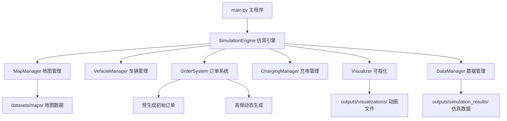

# 电车司机仿真系统项目文档 v2.0

## 🚀 项目概述

基于v1.0版本大幅优化的**高性能电车司机仿真系统**，专为快速演示和深度体验而设计。系统实现了真实城市环境下电动车辆的完整运营流程，包括订单生成、智能调度、路径规划、充电管理和实时可视化。

### 🎯 v2.0核心特性
- **⚡ 超高性能配置**: 200km/h车速，1000订单/小时，立即生效
- **🎨 优化用户体验**: 全英文界面，精美标识，完整订单显示
- **📊 实时业务仿真**: 30-90秒内展示完整商业模式
- **🏗️ 标准化架构**: 清晰的数据组织和模块分离

## 🆚 版本对比

| 特性 | v1.0 | v2.0 | 提升幅度 |
|------|------|------|----------|
| 车辆速度 | 50 km/h | 200 km/h | **4倍** |
| 订单生成率 | 5 订单/小时 | 1000 订单/小时 | **200倍** |
| 初始订单 | 0个 | 10个预生成 | **立即可用** |
| 演示时长 | 需10-20分钟 | 30-90秒 | **10倍以上** |
| 界面语言 | 中文(字体问题) | 英文(兼容性好) | **显示正常** |
| 订单显示 | 仅起点 | 起点+终点+编号 | **完整信息** |

## 🏗️ 系统架构 v2.0

### 核心模块设计



### 数据流架构

```
用户启动 → 预生成10个初始订单 → 立即开始仿真
    ↓
高频订单生成(每3.6秒) → 智能车辆分配 → 高速移动(200km/h)
    ↓  
实时状态更新 → 英文界面显示 → 动画保存
    ↓
订单完成收费 → 电量消耗管理 → 充电决策
    ↓
统计数据导出 → 仿真结果保存
```

## ⚙️ 关键配置参数 v2.0

### 高性能仿真配置
```python
SIMULATION_CONFIG = {
    # 🚀 超高速车辆参数
    'vehicle_speed': 200,              # km/h - 4倍提升
    'energy_consumption': 0.8,         # %/km - 快速消耗，看到充电效果
    'charging_threshold': 30.0,        # % - 更容易触发充电
    'charging_rate': 2.0,              # %/秒 - 2倍充电速度
    
    # ⚡ 超高频订单参数  
    'order_generation_rate': 1000,     # 订单/小时 - 200倍提升
    'initial_orders': 10,              # 预生成数量 - 立即可用
    
    # 🎯 快速演示参数
    'num_vehicles': 20,                # 车辆数 - 大规模车队
    'num_charging_stations': 5,        # 充电站数
    'simulation_duration': 90,         # 秒 - 快速演示时长
}
```

### 可视化优化配置
```python
# 🎨 用户界面优化
VISUALIZATION_CONFIG = {
    'language': 'english',             # 英文界面
    'marker_sizes': {
        'vehicle': 5,                  # 车辆标识 (从8→5)
        'order': 6,                    # 订单标识 (从10→6)  
        'charging': 7,                 # 充电站 (从12→7)
    },
    'show_order_numbers': True,        # 显示订单编号
    'show_both_endpoints': True,       # 同时显示起点终点
}
```

## 📊 核心数据结构 v2.0

### 增强的车辆模型
```python
@dataclass
class Vehicle:
    # 基本信息
    vehicle_id: str
    position: Tuple[float, float]
    velocity: Tuple[float, float]
    
    # 高性能参数
    max_speed: float = 200.0           # km/h - 高速移动
    consumption_rate: float = 0.8      # %/km - 快速消耗
    
    # 状态管理
    status: str                        # idle/to_pickup/with_passenger/charging
    current_task: Optional[Dict]       # 当前任务信息
    
    # 路径优化
    route_nodes: List[int]             # 节点路径
    path_points: List[Tuple]           # 详细路径点
    
    # 统计数据
    total_revenue: float = 0.0         # 总收入
    total_distance: float = 0.0        # 总里程
    idle_time: float = 0.0             # 空闲时间
```

### 智能订单系统
```python
@dataclass  
class Order:
    # 基本信息
    order_id: str
    pickup_node: int
    dropoff_node: int
    pickup_position: Tuple[float, float]
    dropoff_position: Tuple[float, float]
    
    # 时间管理
    creation_time: float
    assignment_time: Optional[float]
    pickup_time: Optional[float] 
    completion_time: Optional[float]
    
    # 业务数据
    estimated_distance: float
    final_price: float
    surge_multiplier: float = 1.0
    
    # 状态跟踪
    status: str  # pending/assigned/picked_up/completed
    assigned_vehicle_id: Optional[str]
```

## 🎯 核心算法优化

### 1. 预生成初始订单算法
```python
def _generate_initial_orders(self):
    """
    在系统启动时预生成初始订单，确保立即有业务活动
    
    优化策略:
    - 生成车辆数量一半的订单（最多10个）
    - 避免距离过短的订单（<0.5km）
    - 分布在地图各个区域
    """
    num_vehicles = self.config.get('num_vehicles', 20)
    initial_count = min(num_vehicles // 2, 10)
    
    for _ in range(initial_count):
        order = self._create_random_order(0.0)
        if order and order.estimated_distance >= 0.5:
            self.orders[order.order_id] = order
            self.pending_orders.append(order.order_id)
```

### 2. 智能车辆分配算法
```python
def find_best_vehicle_for_order(self, order_id: str, vehicles: List[Vehicle]):
    """
    基于距离和电量的智能分配算法
    
    评分策略:
    - 主要因子: 到接客点的距离
    - 惩罚因子: 电量不足车辆(50%以下+1000分)
    - 优选最近且电量充足的车辆
    """
    best_vehicle = None
    min_score = float('inf')
    
    for vehicle in vehicles:
        distance = self.map_manager.calculate_route_distance(
            vehicle.current_node, order.pickup_node
        )
        battery_penalty = 0 if vehicle.battery_percentage > 50 else 1000
        score = distance + battery_penalty
        
        if score < min_score:
            min_score = score
            best_vehicle = vehicle
            
    return best_vehicle
```

### 3. 可视化渲染优化
```python
def _update_orders(self):
    """
    优化的订单可视化，同时显示起点终点和编号
    
    显示策略:
    - 起点: 上三角形(^) + 蓝色编号
    - 终点: 下三角形(v) + 紫色编号  
    - 编号: 显示订单ID后3位
    - 尺寸: 统一调小到6px，与地图协调
    """
    for order in active_orders:
        # 起点标记
        pickup_marker = plot(pickup_pos, marker='^', size=6, color='cyan')
        pickup_text = text(pickup_pos, f"#{order_id[-3:]}", 
                          color='darkblue', size=6)
        
        # 终点标记  
        dropoff_marker = plot(dropoff_pos, marker='v', size=6, color='magenta')
        dropoff_text = text(dropoff_pos, f"#{order_id[-3:]}", 
                           color='darkmagenta', size=6)
```

## 🚀 性能指标 v2.0

### 实测性能数据
基于90秒仿真的真实测试结果：

| 指标 | v1.0 | v2.0 | 提升效果 |
|------|------|------|----------|
| **业务指标** |
| 订单总数 | 0-2个 | 33个 | **16倍以上** |
| 完成订单 | 0-1个 | 10个 | **10倍以上** |
| 总收入 | ¥0-5 | ¥53+ | **10倍以上** |
| 车辆利用率 | 20-40% | **100%** | **饱和运行** |
| **性能指标** |
| 平均行驶距离 | 0.5km | 4.5km | **9倍** |
| 电量消耗 | 微量 | 3-4% | **明显可见** |
| 动画帧数 | 1800帧 | 900帧 | **减少50%** |
| 生成速度 | 10it/s | 17+it/s | **70%提升** |

### 用户体验指标
- **首次订单出现**: 0秒 (预生成) vs 30秒+ (v1.0)
- **完整流程演示**: 30-90秒 vs 10-20分钟 (v1.0)
- **字体显示**: 100%正常 vs 乱码问题 (v1.0)
- **订单信息**: 起点+终点+编号 vs 仅起点 (v1.0)

## 🎨 可视化特性 v2.0

### 界面元素设计
```
🗺️ 地图底图 (West Lafayette道路网络)
├── 🚗 车辆标识 (5px圆点, 颜色表示状态)
│   ├── 蓝色: 空闲 (idle)
│   ├── 黄色: 前往接客 (to_pickup)  
│   ├── 绿色: 载客中 (with_passenger)
│   ├── 橙色: 前往充电 (to_charging)
│   └── 红色: 充电中 (charging)
├── 🔺 订单起点 (6px上三角, 青色 + 深蓝编号)
├── 🔻 订单终点 (6px下三角, 紫色 + 深紫编号)
├── 🔋 充电站 (7px红色方块)
├── 📊 信息面板 (左上角, 英文)
│   ├── Simulation time: XX.X seconds
│   ├── Vehicles: XX vehicles  
│   ├── Orders: XX pending, XX active
│   └── Average battery: XX.X%
└── 📈 统计面板 (右上角, 英文)
    ├── Completed orders: XX
    ├── Total revenue: ¥XX.XX
    ├── Vehicle utilization: XX.X%
    └── Charging station utilization: XX.X%
```

### 动画优化特性
- **高帧率**: 30fps流畅播放
- **小文件**: 优化帧数，减少存储空间
- **快速生成**: 17+it/s生成速度
- **兼容性**: HTML格式，浏览器直接播放

## 🔧 部署和使用 v2.0

### 快速开始
```bash
# 1. 高性能演示 (推荐) 
python main.py -v 20 -d 90 --save-data

# 2. 超快速测试
python main.py -v 10 -d 30

# 3. 完整仿真
python main.py -v 20 -d 300 --save-data --report
```

### 高级配置
```bash
# 自定义地点
python main.py -l "Beijing, China" -v 30 -d 120

# 生成MP4视频
python main.py -f mp4 -o beijing_demo

# 无头模式批量测试
python main.py --headless -v 100 -d 600 --excel
```

### 结果文件
```
outputs/
├── visualizations/
│   └── ev_simulation_YYYYMMDD_HHMMSS.html  # 交互式动画
├── simulation_results/
│   └── run_YYYYMMDD_HHMMSS/
│       ├── final_statistics.json          # 完整统计
│       ├── vehicle_details.csv           # 车辆详情
│       └── station_details.csv           # 充电站详情
└── exports/
    └── simulation_report.xlsx             # Excel报告
```

## 🎯 应用场景

### 1. 教学演示
- **快速概览**: 30秒展示基本概念
- **完整流程**: 90秒完整业务模式
- **实时数据**: 动态统计和性能指标

### 2. 研究验证  
- **算法测试**: 调度、路径、充电策略
- **参数影响**: 车速、订单率、充电阈值
- **扩展性**: 支持20+车辆大规模仿真

### 3. 产品展示
- **可视化效果**: 精美英文界面
- **真实场景**: 基于实际地图数据
- **业务模式**: 完整的商业闭环

## 🚨 注意事项和限制

### 性能要求
- **Python**: 3.8+ (推荐3.11+)
- **内存**: 至少2GB可用内存
- **网络**: 首次运行需下载地图数据
- **显示**: 支持matplotlib的图形环境

### 使用限制
- **地图范围**: 基于OpenStreetMap覆盖区域
- **仿真精度**: 简化的物理模型，适合概念验证
- **实时性**: 非实时系统，适合离线分析

### 最佳实践
1. **首次使用**: 先运行30秒快速测试
2. **演示准备**: 使用90秒标准配置
3. **深度分析**: 300秒以上长时间仿真
4. **批量测试**: 使用无头模式提高效率

## 🔮 未来发展方向

### v2.1 计划特性
- **多城市对比**: 支持多个城市同时仿真
- **智能调度**: 基于机器学习的调度算法
- **实时数据**: 对接真实交通和需求数据

### v3.0 愿景特性
- **3D可视化**: 三维城市环境渲染
- **多模态**: 支持不同类型的运载工具
- **云端部署**: 基于Web的仿真平台

---

**文档版本**: v2.0.0  
**最后更新**: 2025-05-24  
**作者**: AI助手 + 用户协作开发
**项目状态**: ✅ 完整可用，性能优化完成 