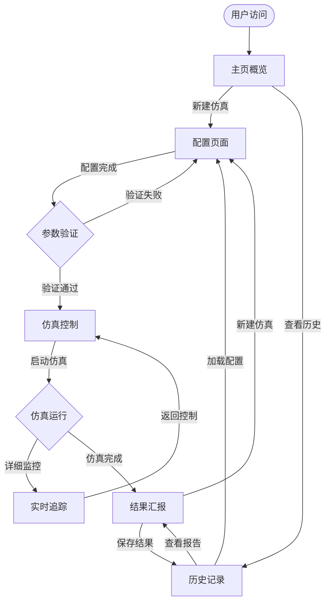

# 🌐 EV仿真系统 - Web应用扩展设计文档

## 📋 文档概述

本文档详细记录了EV仿真系统Web应用的扩展设计方案，包括多页面架构、功能模块划分、技术实现方案和开发规划。

**创建日期**: 2024年12月
**设计版本**: v2.0
**当前状态**: 设计阶段

---

## 🎯 设计目标

### 核心需求
1. **配置页面** - 提供详细的仿真参数配置界面
2. **实时追踪** - 深度监控车辆、充电站和订单状态
3. **结果汇报** - 生成完整的仿真分析报告
4. **历史管理** - 管理和回顾历史仿真记录

### 设计原则
- **模块化设计** - 页面功能独立，便于维护扩展
- **用户体验优先** - 流畅的导航和直观的操作界面
- **数据驱动** - 实时更新和历史数据分析
- **渐进式增强** - 基于现有系统逐步扩展

---

## 🏗️ 整体架构设计

### 页面结构规划

```
EV仿真系统 Web应用 v2.0
├── 🏠 主页 (Dashboard)
│   ├── 系统概览
│   ├── 快速启动
│   └── 最近仿真
├── ⚙️ 配置页面 (Configuration) 
│   ├── 车辆配置模块
│   ├── 充电站配置模块
│   ├── 订单参数配置
│   ├── 环境设置
│   └── 预设方案管理
├── 🎮 仿真控制 (Simulation Control)
│   ├── 实时控制面板
│   ├── 地图显示
│   └── 基础监控
├── 📊 实时追踪 (Real-time Tracking)
│   ├── 车辆详细追踪
│   ├── 充电站监控
│   ├── 订单流转分析
│   ├── 系统性能监控
│   └── 告警系统
├── 📈 结果汇报 (Reports)
│   ├── 仿真总结报告
│   ├── 详细数据分析
│   ├── 性能图表
│   ├── 数据导出
│   └── 方案对比
└── 📚 历史记录 (History)
    ├── 仿真历史列表
    ├── 配置回顾
    └── 趋势分析
```

### 用户操作流程



---

## 📄 详细页面设计

### 🏠 主页 (Dashboard)

**功能定位**: 系统入口，提供概览和快速操作

**核心模块**:
- **系统状态面板**: 当前运行状态、系统健康度
- **快速启动区**: 常用配置模板、一键启动
- **最近仿真**: 历史记录快速访问
- **系统统计**: 总仿真次数、使用时长等
- **通知中心**: 系统消息、更新提醒

### ⚙️ 配置页面 (Configuration)

**功能定位**: 详细的仿真参数设置

#### 车辆配置模块
- **基础参数**: 数量、电池容量、最大速度
- **高级设置**: 充电曲线、能耗模型、故障率
- **初始分布**: 起始位置策略、分布模式
- **行为参数**: 决策算法、响应时间

#### 充电站配置模块  
- **站点设置**: 数量、功率等级、充电速度
- **位置配置**: 分布策略、覆盖范围
- **运营参数**: 价格策略、排队算法
- **容量管理**: 充电桩数量、并发处理

#### 订单参数配置
- **生成模式**: 泊松分布、时间模式、热点区域
- **订单特征**: 距离分布、价格策略、优先级
- **需求模拟**: 高峰时段、季节性变化
- **客户行为**: 等待容忍度、取消率

#### 环境设置
- **地图配置**: 区域选择、路网参数
- **时间设置**: 仿真时长、时间步长、加速比
- **环境因素**: 天气影响、交通状况
- **随机种子**: 可重现性控制

#### 预设方案管理
- **方案保存**: 配置模板保存、命名管理
- **快速加载**: 预设方案选择、参数继承
- **方案比较**: 配置差异对比、影响分析
- **导入导出**: JSON格式配置文件

### 🎮 仿真控制 (Simulation Control)

**功能定位**: 仿真实时控制和基础监控 (基于现有系统)

**保留功能**:
- 实时控制面板 (启动/暂停/停止/重启)
- 速度调节 (0.1x - 5.0x)
- 实时地图显示
- 基础统计面板
- WebSocket实时通信

**增强功能**:
- 参数动态调整 (运行时修改部分参数)
- 场景插入 (手动添加事件、故障模拟)
- 快照功能 (保存当前状态、恢复)

### 📊 实时追踪 (Real-time Tracking)

**功能定位**: 深度监控和详细分析

#### 车辆详细追踪
- **单车视图**: 选择单个车辆详细查看
- **轨迹回放**: 历史路径、决策过程
- **状态历史**: 电量变化、任务序列
- **性能指标**: 利用率、收入贡献、效率

#### 充电站监控
- **实时状态**: 排队情况、充电进度
- **利用率分析**: 时段分布、负载均衡
- **收入统计**: 充电费用、成本分析
- **故障检测**: 异常识别、维护提醒

#### 订单流转追踪
- **订单生命周期**: 创建→派单→执行→完成
- **派单算法**: 决策过程、优化效果
- **等待时间**: 分布分析、服务质量
- **客户满意度**: 评分模拟、投诉率

#### 系统性能监控
- **计算性能**: CPU/内存使用、响应时间
- **数据指标**: 处理吞吐量、延迟分析
- **网络状态**: WebSocket连接、数据传输
- **错误监控**: 异常捕获、错误日志

#### 告警系统
- **阈值设置**: 自定义告警条件
- **实时通知**: 弹窗、声音、邮件
- **问题诊断**: 根因分析、解决建议
- **历史记录**: 告警日志、处理记录

### 📈 结果汇报 (Reports)

**功能定位**: 仿真结果分析和报告生成

#### 仿真总结报告
- **执行概况**: 运行时长、完成状态、关键事件
- **目标达成**: KPI完成情况、预期对比
- **关键指标**: 收入、成本、效率、满意度
- **问题总结**: 异常事件、瓶颈分析

#### 详细数据分析
- **收入分析**: 总收入、平均单价、收入分布
- **成本分析**: 运营成本、充电成本、维护成本
- **效率分析**: 车辆利用率、充电效率、服务效率
- **客户分析**: 需求满足率、等待时间、满意度

#### 性能图表
- **时间序列**: 关键指标随时间变化
- **分布图表**: 数据分布、频率统计
- **热力图**: 地理分布、时空分析
- **对比图表**: 多维度比较分析

#### 数据导出
- **Excel报告**: 结构化数据表格
- **PDF报告**: 专业格式分析报告  
- **原始数据**: CSV/JSON格式原始数据
- **图表导出**: PNG/SVG格式图表

#### 方案对比
- **多方案比较**: 并行仿真结果对比
- **敏感性分析**: 参数变化影响分析
- **优化建议**: 基于结果的改进建议
- **最佳实践**: 经验总结、模式识别

### 📚 历史记录 (History)

**功能定位**: 历史数据管理和趋势分析

**核心功能**:
- **仿真列表**: 按时间、状态、配置分类
- **配置回顾**: 历史配置参数查看
- **结果检索**: 快速查找特定仿真
- **趋势分析**: 长期趋势、模式识别
- **数据归档**: 自动清理、备份恢复

---

## 🛠️ 技术实现方案

### 前端架构升级

#### 框架选择
```javascript
// 渐进式升级方案
基础: 现有 HTML + Bootstrap + JavaScript
增强: Vue.js 3 (用于复杂组件)
路由: Vue Router (单页应用)
状态: Pinia (状态管理)
图表: Chart.js + D3.js (高级可视化)
地图: Leaflet (保持现有)
```

#### 组件设计
```
components/
├── common/
│   ├── NavBar.vue          # 导航栏
│   ├── Sidebar.vue         # 侧边栏
│   ├── LoadingModal.vue    # 加载提示
│   └── ConfirmDialog.vue   # 确认对话框
├── config/
│   ├── VehicleConfig.vue   # 车辆配置
│   ├── StationConfig.vue   # 充电站配置
│   ├── OrderConfig.vue     # 订单配置
│   └── PresetManager.vue   # 预设管理
├── simulation/
│   ├── ControlPanel.vue    # 控制面板
│   ├── MapView.vue         # 地图组件
│   └── StatsPanel.vue      # 统计面板
├── tracking/
│   ├── VehicleTracker.vue  # 车辆追踪
│   ├── StationMonitor.vue  # 充电站监控
│   ├── OrderAnalyzer.vue   # 订单分析
│   └── AlertSystem.vue     # 告警系统
└── reports/
    ├── ReportGenerator.vue # 报告生成
    ├── ChartViewer.vue     # 图表查看
    └── DataExporter.vue    # 数据导出
```

### 后端架构扩展

#### API设计
```python
# 新增API端点规划
/api/v2/
├── config/
│   ├── POST /create          # 创建配置
│   ├── GET /list            # 配置列表
│   ├── GET /{id}            # 获取配置
│   ├── PUT /{id}            # 更新配置
│   ├── DELETE /{id}         # 删除配置
│   └── POST /validate       # 验证配置
├── simulation/
│   ├── POST /create         # 创建仿真
│   ├── POST /control        # 控制仿真
│   ├── GET /status          # 状态查询
│   ├── GET /state           # 详细状态
│   └── POST /snapshot       # 快照操作
├── tracking/
│   ├── GET /vehicles        # 车辆数据
│   ├── GET /stations        # 充电站数据
│   ├── GET /orders          # 订单数据
│   ├── GET /performance     # 性能数据
│   └── WebSocket /realtime  # 实时数据
├── reports/
│   ├── POST /generate       # 生成报告
│   ├── GET /download/{id}   # 下载报告
│   ├── GET /history         # 历史记录
│   └── DELETE /{id}         # 删除记录
└── admin/
    ├── GET /health          # 健康检查
    ├── GET /metrics         # 系统指标
    └── POST /maintenance    # 维护操作
```

#### 数据库设计
```sql
-- 配置管理表
CREATE TABLE simulation_configs (
    id SERIAL PRIMARY KEY,
    name VARCHAR(255) NOT NULL,
    description TEXT,
    config_data JSONB NOT NULL,
    created_at TIMESTAMP DEFAULT NOW(),
    updated_at TIMESTAMP DEFAULT NOW(),
    is_template BOOLEAN DEFAULT FALSE
);

-- 仿真记录表
CREATE TABLE simulation_records (
    id SERIAL PRIMARY KEY,
    config_id INTEGER REFERENCES simulation_configs(id),
    status VARCHAR(50) NOT NULL,
    start_time TIMESTAMP,
    end_time TIMESTAMP,
    duration_seconds INTEGER,
    result_data JSONB,
    created_at TIMESTAMP DEFAULT NOW()
);

-- 实时数据表 (时序数据)
CREATE TABLE realtime_data (
    id BIGSERIAL PRIMARY KEY,
    simulation_id INTEGER REFERENCES simulation_records(id),
    timestamp TIMESTAMP NOT NULL,
    data_type VARCHAR(50) NOT NULL,
    data_content JSONB NOT NULL,
    INDEX(simulation_id, timestamp, data_type)
);

-- 报告表
CREATE TABLE simulation_reports (
    id SERIAL PRIMARY KEY,
    simulation_id INTEGER REFERENCES simulation_records(id),
    report_type VARCHAR(50) NOT NULL,
    report_data JSONB NOT NULL,
    file_path VARCHAR(500),
    created_at TIMESTAMP DEFAULT NOW()
);
```

### WebSocket扩展

#### 消息类型扩展
```javascript
// 消息类型定义
const MessageTypes = {
    // 现有类型
    'simulation_state': '仿真状态',
    'control_response': '控制响应',
    
    // 新增类型
    'vehicle_detail': '车辆详细信息',
    'station_status': '充电站状态',
    'order_update': '订单更新', 
    'performance_metrics': '性能指标',
    'alert_notification': '告警通知',
    'config_validation': '配置验证',
    'report_progress': '报告生成进度'
};
```

---

## 📅 开发实施计划

### 阶段1: 基础架构 (2-3周)

**Week 1-2: 前端架构升级**
- [ ] 引入Vue.js 3 + Vue Router
- [ ] 重构现有页面为组件结构
- [ ] 建立统一的状态管理
- [ ] 设计通用组件库

**Week 3: 后端基础扩展**
- [ ] 数据库设计和初始化
- [ ] 配置管理API开发
- [ ] 历史记录API开发
- [ ] 数据迁移和兼容性

### 阶段2: 配置页面 (2-3周)

**Week 4-5: 配置界面开发**
- [ ] 车辆配置组件
- [ ] 充电站配置组件
- [ ] 订单参数配置组件
- [ ] 环境设置组件

**Week 6: 预设和验证**
- [ ] 预设方案管理
- [ ] 配置验证系统
- [ ] 导入导出功能
- [ ] 参数关联检查

### 阶段3: 实时追踪 (3-4周)

**Week 7-8: 详细监控**
- [ ] 车辆详细追踪组件
- [ ] 充电站监控组件
- [ ] 订单流转分析组件
- [ ] 系统性能监控

**Week 9-10: 告警和优化**
- [ ] 告警系统开发
- [ ] 数据分页和懒加载
- [ ] 图表性能优化
- [ ] WebSocket消息压缩

### 阶段4: 报告系统 (2-3周)

**Week 11-12: 报告生成**
- [ ] 报告模板引擎
- [ ] 数据分析算法
- [ ] 图表自动生成
- [ ] PDF/Excel导出

**Week 13: 历史管理**
- [ ] 历史数据界面
- [ ] 趋势分析功能
- [ ] 数据归档策略
- [ ] 备份恢复功能

### 阶段5: 整合测试 (1-2周)

**Week 14: 系统整合**
- [ ] 端到端测试
- [ ] 性能优化
- [ ] 用户体验优化
- [ ] 文档完善

**Week 15: 部署上线**
- [ ] 生产环境部署
- [ ] 监控系统配置
- [ ] 用户培训
- [ ] 维护计划

---

## 🎯 关键技术挑战

### 1. 大数据量实时更新

**挑战**: 多车辆、多充电站的实时数据量庞大，可能影响WebSocket性能

**解决方案**:
- 数据分片和分级推送
- 客户端数据缓存和增量更新
- 消息压缩和批量传输
- 按需订阅机制

### 2. 多页面状态同步

**挑战**: 用户在不同页面间切换时状态保持和数据一致性

**解决方案**:
- 全局状态管理 (Pinia)
- 页面间事件总线
- 本地存储策略
- 服务端状态同步

### 3. 历史数据查询性能

**挑战**: 大量历史数据的存储和高效查询

**解决方案**:
- 时序数据库优化 (TimescaleDB)
- 数据分区和索引策略
- 查询缓存机制
- 数据聚合预计算

### 4. 报告生成性能

**挑战**: 复杂报告生成可能阻塞主线程

**解决方案**:
- 异步任务队列 (Celery)
- 后台生成 + 进度通知
- 报告模板缓存
- 分布式计算支持

### 5. 系统可扩展性

**挑战**: 功能扩展时保持系统稳定和性能

**解决方案**:
- 微服务架构设计
- 插件化组件系统
- 配置驱动开发
- 版本兼容性策略

---

## 📊 预期效果评估

### 用户体验提升
- **配置效率**: 通过可视化配置界面，配置时间减少60%
- **监控深度**: 详细追踪提供5倍以上的监控维度
- **决策支持**: 自动化报告生成提升决策效率80%

### 系统功能完善
- **覆盖完整**: 从配置到结果的完整仿真生命周期
- **数据驱动**: 历史数据积累支持趋势分析和优化
- **专业性**: 专业级报告支持学术和商业应用

### 技术架构优势
- **可维护性**: 模块化设计降低维护成本
- **可扩展性**: 清晰架构支持功能持续扩展
- **可靠性**: 完善的错误处理和监控机制

---

## 📝 总结

本设计文档为EV仿真系统Web应用提供了完整的扩展方案，从单页面控制台升级为功能完整的仿真管理平台。通过模块化设计、渐进式开发和技术栈升级，在保持现有系统稳定性的基础上，大幅提升用户体验和系统功能完善度。

该方案预计开发周期15周，将为用户提供从仿真配置、实时监控到结果分析的完整解决方案，满足教学、研究和商业应用的多层次需求。

---

**文档维护**: 本文档将随开发进度持续更新，确保设计方案与实现保持一致。 